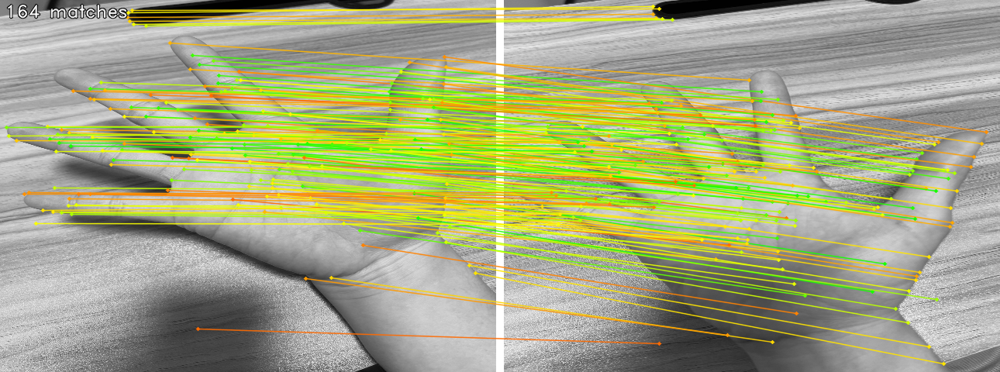

# 🖐️ 손 사진을 이용한 동일 인물 판단 프로젝트 (SuperPoint + SuperGlue 기반)

<p align="center">
  
</p>

이 프로젝트는 **서로 다른 손 사진 두 장**을 비교해서  
**같은 사람의 손인지**, 또는 **다른 사람의 손인지** 판단하는 실습형 컴퓨터 비전 과제입니다.  
논문 기반의 모델인 **SuperPoint**와 **SuperGlue**를 사용하여 keypoint를 추출하고 매칭합니다.

---

##  이 프로젝트는 어떤 걸 하나요?

- 손 사진 2장을 넣으면,
- 특징점을 찾아 서로 연결하고,
- **얼마나 잘 맞는지(=매칭 수)** 기준으로 동일 인물인지 판단합니다.

### 사용된 모델

| 모델 이름 | 설명 |
|-----------|------|
|  SuperPoint | 손 이미지에서 특징점과 descriptor 추출 |
|  SuperGlue | 두 이미지 간 descriptor를 GNN 기반으로 정교하게 연결 |

---

## 📂 폴더 구조 설명

```bash
├── assets/               # 손 사진을 넣는 폴더
│   └── hand/             # 비교할 손 이미지가 들어가는 폴더
│       ├── 1.jpg         # 예시 이미지
│       ├── 2.jpg         # 예시 이미지
│       └── ...
├── models/               # 모델 코드 (SuperPoint, SuperGlue)
│   └── weights/          # 사전학습된 모델 가중치
├── result/               # 매칭 결과 이미지 저장 폴더
├── hand_match.py         # 메인 실행 코드
├── result_match.png      # 결과 이미지 출력 (자동 생성됨)
├── requirements.txt      # 필요한 패키지 목록
└── README.md             # 설명서 (본 문서)
